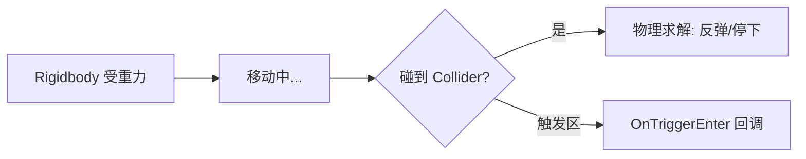

## 先建立直觉

真实世界里，一个苹果会**因为重力下落**、**撞到地面停住**、**被推一下会滚动**。Unity 的物理引擎（基于 NVIDIA PhysX）就是把这套规则数字化：

- **Rigidbody（刚体）** = 「这东西受物理控制」的开关。挂了它，物体就有了质量、会受重力、能被施力；
- **Collider（碰撞体）** = 「这东西的形状边界」。没它，物体会互相穿透；
- 引擎每一物理帧（默认 0.02s）算一遍「谁撞谁、受力怎么动」。

> 没 Rigidbody 的物体是「静态墙」，有 Rigidbody 的是「会动的实体」。两者都需要 Collider 才能碰撞。

## 它解决什么问题

1. **免手写物理公式**：掉落、弹跳、摩擦、堆叠都自动算；
2. **碰撞检测**：子弹命中、角色站稳地面、门被推开；
3. **触发区域**：进入陷阱区扣血、到达终点触发胜利。



## 核心概念

### 1. Rigidbody 关键属性

| 属性 | 含义 |
|------|------|
| **Mass** | 质量，影响惯性与碰撞反应 |
| **Drag** | 空气阻力（线性） |
| **Angular Drag** | 旋转阻力 |
| **Use Gravity** | 是否受重力 |
| **Is Kinematic** | 不受力，但可代码驱动（常用于电梯、门） |
| **Constraints** | 冻结某轴移动/旋转 |

### 2. 三种移动方式

```csharp
using UnityEngine;

public class PhysMove : MonoBehaviour
{
    Rigidbody rb;

    void Awake() => rb = GetComponent<Rigidbody>();

    void FixedUpdate()   // 物理必须放 FixedUpdate
    {
        // 方式1：直接设速度（最可控，角色常用）
        // rb.velocity = new Vector3(0, rb.velocity.y, 5f);

        // 方式2：施力（有加速度感，适合抛射）
        // rb.AddForce(Vector3.up * 10f);

        // 方式3：施加冲量（瞬间速度变化，如跳跃）
        // rb.AddImpulse(Vector3.up * 6f);
    }
}
```

> **velocity 直接赋值 vs AddForce**：设 velocity 会「覆盖」当前速度（角色手感硬）；AddForce 是叠加（更物理）。跳跃通常用 `AddImpulse` 或直接在 `velocity.y` 上 + 一个值。

### 3. 碰撞体 Collider

| 类型 | 形状 | 用途 |
|------|------|------|
| `Box Collider` | 盒 | 箱子、墙 |
| `Sphere Collider` | 球 | 滚球、爆炸范围 |
| `Capsule Collider` | 胶囊 | 角色（最常用） |
| `Mesh Collider` | 贴模型 | 精确但贵，建筑/地形 |

> **性能提醒**：`Mesh Collider`  Convex 开销大，移动物体尽量用基础形状。地形可用 `Terrain Collider`。

### 4. 碰撞 vs 触发回调

```csharp
// 碰撞（双方都有 Collider + 至少一方有 Rigidbody，未勾 Is Trigger）
void OnCollisionEnter(Collision other)
{
    if (other.gameObject.CompareTag("Ground"))
        Debug.Log("落地");
}

// 触发（有一方 Collider 勾了 Is Trigger，不产生物理阻挡，只通知）
void OnTriggerEnter(Collider other)
{
    if (other.CompareTag("Coin"))
    {
        Destroy(other.gameObject);  // 吃金币
        Score += 1;
    }
}
```

| 场景 | 用哪种 |
|------|--------|
| 子弹打中敌人（要弹开） | `OnCollisionEnter` |
| 穿过获取道具/进入区域 | `OnTriggerEnter` |

### 5. 物理材质（Physic Material）

控制摩擦（Friction）与弹性（Bounciness）：建一个 `Physic Material`，设 `Bounciness = 1` 的球会一直弹，设 `Friction` 高的地面不打滑。

## 常见坑

1. **物体穿透（Tunneling）**：高速小物体一帧穿过大碰撞体。解决：用 `Continuous` / `Continuous Dynamic` 碰撞检测模式，或限速。
2. **在 Update 里改 Rigidbody**：导致抖动/不一致。物理一律 `FixedUpdate`。
3. **触发没反应**：忘记勾 Collider 的 `Is Trigger`，或双方都没 Rigidbody（触发至少需一方有 RB 或开启相关设置）。
4. **Mass 设成 0 或负**：非法值，物理会异常。质量用现实比例（角色 70，箱子 10）。
5. **Kinematic 还指望被重力推**：勾了 Is Kinematic 就脱离了物理模拟，只能代码动它。

## 小结

- Rigidbody = 受物理控制开关；Collider = 碰撞形状；两者配合才有碰撞；
- 移动放 `FixedUpdate`：设 velocity / AddForce / AddImpulse 三选一；
- 碰撞 `OnCollisionEnter`（实体碰撞），触发 `OnTriggerEnter`（穿入区域）；
- 物理材质控制摩擦与弹性；
- 下一章：输入系统与角色控制，把键盘鼠标接到角色上。
