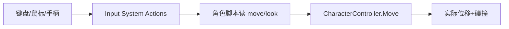

## 先建立直觉

游戏要「听玩家的」。玩家敲键盘、动鼠标、推杆，游戏要把这些信号变成「角色往前跑、镜头转过去」。

- **输入（Input）** = 读取玩家意图（按了 W、鼠标右移 5px）；
- **角色控制（Character Controller）** = 把意图翻译成移动，同时处理「撞墙停下、上下坡、踩地面」。

> Unity 有两套输入：老式 `Input.GetKeyDown`（简单但难扩展）与新一代 **Input System**（基于 Action，支持多设备、重映射）。新项目推荐 Input System。

## 它解决什么问题

1. **多设备统一**：键盘、手柄、触屏用同一套 Action 抽象；
2. **重映射**：玩家自定义按键无需改代码；
3. **角色手感**：用 `CharacterController` 自动处理碰撞、台阶、坡度，比手写物理省心。



## 核心概念

### 1. 传统输入（快速上手）

```csharp
void Update()
{
    float h = Input.GetAxis("Horizontal"); // A/D 或 ←/→，返回 -1~1
    float v = Input.GetAxis("Vertical");   // W/S
    if (Input.GetKeyDown(KeyCode.Space))
        Jump();

    transform.Translate(h * speed * Time.deltaTime, 0, v * speed * Time.deltaTime);
}
```

> `GetAxis` 带平滑（缓动），`GetAxisRaw` 是硬切换。跳跃用 `GetKeyDown`（按下瞬间触发一次）。

### 2. 新一代 Input System（推荐）

1. `Window → Package Manager` 安装 **Input System**；
2. `Project` 右键 → `Create → Input Actions`，定义 Action：`Move`(WASD/左杆)、`Look`(鼠标/右杆)、`Jump`(空格)；
3. 生成 C# 类（如 `PlayerInputActions`），在脚本里订阅。

```csharp
using UnityEngine;
using UnityEngine.InputSystem;

public class Player : MonoBehaviour
{
    PlayerInputActions input;
    Vector2 moveVec;

    void Awake()
    {
        input = new PlayerInputActions();
        input.Player.Move.performed += ctx => moveVec = ctx.ReadValue<Vector2>();
        input.Player.Move.canceled  += ctx => moveVec = Vector2.zero;
    }
    void OnEnable()  => input.Enable();
    void OnDisable() => input.Disable();

    void Update()
    {
        // moveVec.x 左右, moveVec.y 前后
        var dir = new Vector3(moveVec.x, 0, moveVec.y);
        transform.Translate(dir * speed * Time.deltaTime);
    }
}
```

### 3. CharacterController 实现移动

`CharacterController` 是「不受物理力、自管碰撞」的角色专用组件（带胶囊碰撞体）：

```csharp
using UnityEngine;

[RequireComponent(typeof(CharacterController))]
public class ThirdPerson : MonoBehaviour
{
    CharacterController cc;
    public float speed = 5f, gravity = -9.8f, jump = 4f;
    float vy; // 垂直速度

    void Awake() => cc = GetComponent<CharacterController>();

    void Update()
    {
        float h = Input.GetAxis("Horizontal");
        float v = Input.GetAxis("Vertical");
        Vector3 move = transform.right * h + transform.forward * v;

        if (cc.isGrounded) vy = -2f;            // 接地维持微向下
        else vy += gravity * Time.deltaTime;     // 自由落体
        if (Input.GetButtonDown("Jump") && cc.isGrounded) vy = jump;

        move.y = vy;
        cc.Move(move * (cc.isGrounded ? speed : speed) * Time.deltaTime);
    }
}
```

> `cc.isGrounded` 检测是否踩地；`cc.Move()` 内部处理与地形碰撞，撞墙自动停。重力要手动积分（Unity 不给 CC 自动重力）。

### 4. 鼠标控制视角

```csharp
public Transform cameraPivot;
float yaw, pitch;

void Update()
{
    yaw   += Input.GetAxis("Mouse X") * sensitivity;
    pitch -= Input.GetAxis("Mouse Y") * sensitivity;
    pitch  = Mathf.Clamp(pitch, -80f, 80f);     // 限制俯仰
    cameraPivot.rotation = Quaternion.Euler(pitch, yaw, 0);
    transform.rotation = Quaternion.Euler(0, yaw, 0); // 角色只跟 yaw 转
}
```

## 常见坑

1. **Move 不乘 Time.deltaTime 导致速度随帧率变**：`CharacterController.Move` 接收的是「本帧位移」，必须 × deltaTime。
2. **重力无限累积**：接地时要把 vy 重置（如 `-2f`），否则离地瞬间速度爆炸。
3. **输入系统没 Enable**：新 Input System 必须 `input.Enable()`，且脚本 `OnDisable` 时 `Disable()`，否则无响应或泄漏。
4. **角色穿墙**：`CharacterController` 不与 `Rigidbody` 物体正常碰撞（它只检测静态/CC 碰撞体）。需要互动的物理物体用刚体 + 自定义。
5. **鼠标锁不住**：第一人称通常 `Cursor.lockState = CursorLockMode.Locked`。

## 小结

- 输入：老式 `Input.GetAxis/GetKeyDown` 简单；新 Input System 用 Action 抽象、可重映射；
- `CharacterController` 自管碰撞移动，重力需手动积分，`isGrounded` 判接地；
- 视角用鼠标 delta 累加 yaw/pitch，pitch 要 clamp；
- 下一章：动画系统，让角色动起来有「走路/跳跃」的动作。
