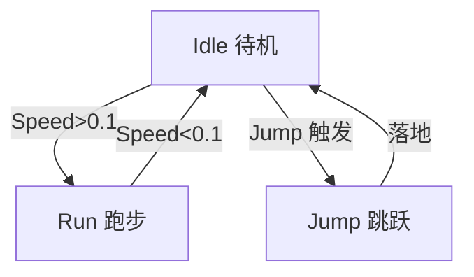

## 先建立直觉

一个「会动的人形角色」不是一段连续录像，而是**多个动画片段（Clip）+ 一套切换规则**：

- **Clip** = 一小段动作（Idle 待机、Run 跑步、Jump 跳跃）；
- **状态机（Animator Controller）** = 决定「现在播哪段、何时切到下一段」的图；
- **参数（Parameter）** = 你从代码塞进去的开关（如 `speed` 大小决定走还是跑）。

> 类比 DVD 机：Clip 是不同影片，状态机是「遥控器逻辑」，参数是你按的按钮。代码只负责按按钮，机器自己切片。

## 它解决什么问题

1. **片段复用与过渡**：走路切跑步要平滑混合，不能硬切；
2. **数据驱动**：代码只设 `animator.SetFloat("Speed", v)`，动画层自己处理；
3. **人形重定向（Avatar）**：同一套动画可套到不同角色模型上。



## 核心概念

### 1. 三大件

| 件 | 是什么 | 怎么来 |
|----|--------|--------|
| **Animation Clip** | 一段关键帧动画 | 自己 K 帧，或从模型导入（FBX 自带） |
| **Animator Controller** | 状态机 .controller 文件 | `Create → Animator Controller`，拖 Clip 进状态 |
| **Animator 组件** | 挂模型上、引用 Controller | 模型自带或手动添加 |

### 2. 建一个简单的状态机

1. 选中模型，确认有 `Animator` 组件（无则 `Add Component → Animator`），把 Controller 拖进去；
2. 打开 `Window → Animation → Animator`，看到状态机画布；
3. 右键 `Create State → Empty` 建状态，把 Clip 赋给它；把常用状态设为 **Entry 默认**；
4. 在状态间 **右键 → Make Transition** 连线；
5. 在左侧 **Parameters** 加参数，比如 `float Speed`、`bool IsJump`。

### 3. 代码驱动切换

```csharp
using UnityEngine;

public class AnimDriver : MonoBehaviour
{
    Animator anim;

    void Awake() => anim = GetComponent<Animator>();

    void Update()
    {
        float speed = new Vector3(
            Input.GetAxis("Horizontal"), 0, Input.GetAxis("Vertical")
        ).magnitude;

        anim.SetFloat("Speed", speed);                 // 连续量 → 混合树
        if (Input.GetKeyDown(KeyCode.Space))
            anim.SetBool("IsJump", true);
        else
            anim.SetBool("IsJump", false);
    }
}
```

参数类型：`SetFloat` / `SetBool` / `SetInt` / `SetTrigger`（一次性触发，最适跳跃、攻击）。

### 4. 混合树（Blend Tree）——平滑走跑

单一 `Speed` 参数在 0→1 间变化时，若直接在两个 Clip 间切换会硬。用 **Blend Tree**：

1. 在状态机右键 → `Create State → From Blend Tree`；
2. 双击进入，加 `Motion`：`Idle`(阈值0)、`Walk`(0.5)、`Run`(1)；
3. 用 `Speed` 参数驱动，引擎自动按阈值**线性混合**权重。

> Blend Tree 让「站立→走→跑」连续过渡，是角色动画手感的关键。

### 5. 动画事件（Animation Event）

在 Clip 时间轴上插一个事件点，到那一帧自动调用脚本方法（如脚步声、攻击判定生效）：

```csharp
public void Footstep() => audioSource.PlayOneShot(stepClip);
public void AttackHit() => weapon.EnableHitbox();
```

在 Animation 窗口 Clip 上加 Event，选方法名即可。

## 常见坑

1. **动画不动**：模型没 `Animator` 组件，或 Controller 没赋值，或 Clip 未挂到状态。
2. **过渡卡顿/不切换**：Transition 的 `Has Exit Time` 没关，导致必须播完才能切；实时状态机通常关掉它，用参数条件即时切。
3. **参数名拼错**：`SetFloat("speed")` 但状态机里是 `Speed`，大小写敏感，静默失败。
4. **人形动画不套用**：模型 Import Settings 的 `Animation Type` 需设为 `Humanoid` 且 Avatar 配置正确才能重定向。
5. **Root Motion 冲突**：开了 `Apply Root Motion` 又手动 `Translate`，角色会「飘」。二选一：让动画带位移就开 Root Motion，否则关掉自己代码移。

## 小结

- Clip（片段）+ Animator Controller（状态机）+ Animator 组件（挂在模型）；
- 代码只设参数（`SetFloat/SetBool/SetTrigger`），状态机负责切；
- 走跑用 Blend Tree 平滑混合；一次性动作（跳跃/攻击）用 Trigger；
- 动画事件在帧上挂方法调用；
- 下一章：UGUI 做界面（血条、按钮、菜单）。
