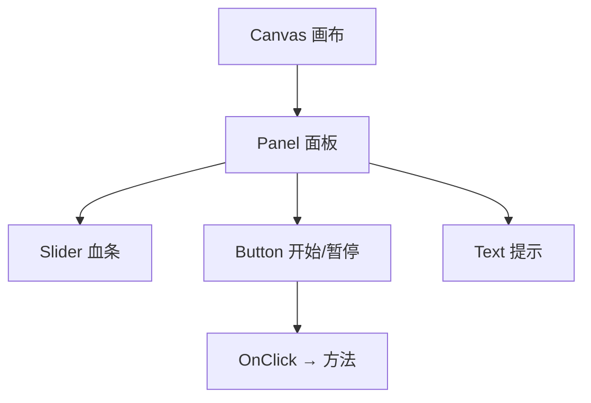

## 先建立直觉

游戏的界面（血条、按钮、技能栏、主菜单）不是画在 3D 世界里，而是叠在**一层独立的 2D 画布（Canvas）**上，像贴在所有画面最前面的玻璃片。

- **Canvas** = 一块 UI 画布，所有界面元素都挂在它下面；
- **RectTransform** = UI 元素的「Transform」，但管的是「在画布里的矩形位置与锚点」；
- **Button / Slider / Text** = 现成控件，拖出来就能用。

> UGUI 的核心是「锚点（Anchor）」：它决定了控件相对父容器（或屏幕）的**对齐与自适应方式**。搞懂锚点，UI 才能在不同分辨率下不乱跑。

## 它解决什么问题

1. **屏幕自适应**：锚点让按钮「永远贴右下角」、血条「永远顶部拉伸」；
2. **事件驱动**：按钮点击、滑条拖动直接绑 C# 方法；
3. **分层管理**：主菜单、HUD、弹窗各用独立 Canvas/面板组织。



## 核心概念

### 1. Canvas 渲染模式

| 模式 | 说明 | 用途 |
|------|------|------|
| **Screen Space - Overlay** | 画在最前，不依赖相机 | 普通 HUD、菜单（最常用） |
| **Screen Space - Camera** | 由指定相机渲染，可受景深影响 | 需要 UI 与世界混合 |
| **World Space** | UI 在世界坐标里（如 NPC 头顶血条） | 3D 血条、铭牌 |

### 2. RectTransform 与锚点（重点）

每个 UI 元素有 `RectTransform`：

- **Anchor（锚点）**：用四条小箭头定在父矩形的「哪条边」。全贴左上 → 元素永远贴左上；左右拉伸 → 宽度随屏幕变；
- **Pivot（轴心）**：元素自身旋转/缩放的中心；
- **Pos / Size**：相对锚点的偏移与尺寸。

> 经验：血条用「顶部左右锚点」让它随宽度拉伸；按钮用「四角锚点」固定右下角。改锚点时按住 `Alt` 可同时设定位置。

### 3. 常用控件

| 控件 | 作用 |
|------|------|
| `Text (TMP)` | 文字（推荐 TextMeshPro，清晰可缩放） |
| `Image` | 图片/色块 |
| `Button` | 可点击，带 Hover/Press 状态 |
| `Slider` | 滑条（血条、音量） |
| `Toggle` | 开关 |
| `InputField` | 文本输入 |

### 4. 按钮事件绑定（三种方式）

```csharp
using UnityEngine;
using UnityEngine.UI;

public class HUD : MonoBehaviour
{
    public Slider hpSlider;
    public Text hpText;
    public Button pauseBtn;

    void Start()
    {
        // 方式1：代码绑定（最稳）
        pauseBtn.onClick.AddListener(OnPause);

        // 方式2：在 Inspector 把方法拖到 Button 的 OnClick 槽
        // 方式3：EventTrigger 组件做悬停等复杂事件
    }

    void OnPause() => Debug.Log("暂停");

    public void SetHP(float ratio)   // 被角色脚本调用
    {
        hpSlider.value = ratio;                 // 0~1
        hpText.text = $"HP {(int)(ratio*100)}";
    }
}
```

### 5. 做一个血条

1. Canvas 下建 `Panel`（半透明背景）；
2. 里面放 `Slider`，把 `Fill Area` 的子 Image 改成红色；
3. Slider 的 `Max Value = 1`，`Value` 初始 1；
4. 角色受伤时调用 `hud.SetHP(curHP / maxHP)`。

> 血条锚点设成「顶部 + 左右拉伸」，这样窗口变宽血条跟着拉宽，不会缩在一角。

## 常见坑

1. **UI 看不见**：Canvas 渲染模式 Overlay 却没在场景里、或被别的 Canvas 挡住（同模式后添加的在上）。检查 Sorting Order。
2. **按钮点了没反应**：没绑定事件，或按钮被上层透明 Image 挡住（Raycast Target 拦截点击）。把无关 Image 的 `Raycast Target` 关掉。
3. **分辨率一变 UI 乱飞**：锚点没设对。想固定角落就四角锚到那角。
4. **Text 模糊**：用老 `Text` 在高分屏糊；换 `TextMeshPro`（右键 UI → Text - TextMeshPro）。
5. **事件重复 AddListener**：每次 Enable 都 Add 会触发多次，配对 `RemoveListener` 或用 Inspector 绑定一次。

## 小结

- 界面在 Canvas（Overlay 最常用）上，元素是 RectTransform；
- 锚点决定自适应方式，是 UGUI 最核心的概念；
- 按钮 `onClick.AddListener` 绑方法；Slider 做血条；
- 推荐 TextMeshPro，关掉无关 Image 的 Raycast Target；
- 下一章：资源管理与打包发布，把游戏导出成可运行程序。
