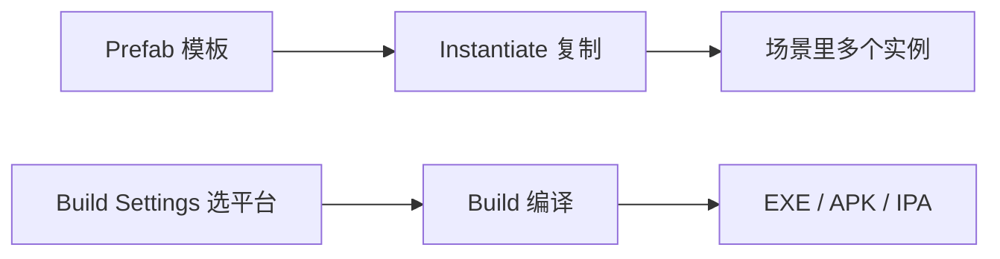

## 先建立直觉

做到这一步，你已经有个能玩的小游戏了。最后两件事：**别重复造轮子**（用预制体复用），以及**把它变成别人能打开的成品**（打包发布）。

- **预制体（Prefab）** = 把「配置好的一个 GameObject」存成模板，随时复制出一模一样的（敌人、子弹、道具）；
- **打包（Build）** = 把工程编译成目标平台的原生程序（EXE / APK / IPA）；
- **Addressables** = 把资源（模型、关卡）按需从网络/磁盘加载，避免一次性全塞进包里。

> 预制体像「盖章」：盖一次出一个成品，改模板所有成品跟着变。打包像「导出 DVD」：选好地区（平台）和格式，一键产出。

## 它解决什么问题

1. **复用与一致性**：100 个敌人用同一 Prefab，调数值改一处；
2. **运行时动态生成**：`Instantiate(prefab)` 在代码里随时造物体（子弹、刷怪）；
3. **控制包体与加载**：Addressables 做热更新、分包、按需下载。



## 核心概念

### 1. 预制体 Prefab

制作与用法：

```csharp
using UnityEngine;

public class Spawner : MonoBehaviour
{
    public GameObject enemyPrefab;   // 把 Prefab 拖进 Inspector

    void Start()
    {
        for (int i = 0; i < 5; i++)
        {
            // 在随机位置生成 5 个敌人
            Vector3 pos = new Vector3(Random.Range(-5, 5), 0, Random.Range(-5, 5));
            Instantiate(enemyPrefab, pos, Quaternion.identity);
        }
    }
}
```

> **Prefab 变体（Variant）**：基于某 Prefab 派生并只覆盖部分属性（如「精英敌人」继承普通敌人但血更多）。大型项目必备。

### 2. 资源加载

**方式 A：Resources（简单但有限制）** — 把资源放 `Resources/` 文件夹，代码按路径加载：

```csharp
GameObject go = Resources.Load<GameObject>("Prefabs/Enemy");
Instantiate(go);
```

> 缺点：Resources 里的东西**永远打进包**，无法热更，且加载路径字符串易错。小项目够用。

**方式 B：Addressables（推荐，专业）** — 资源标记 Addressable，用 key 异步加载，支持远端托管：

```csharp
using UnityEngine.AddressableAssets;
using UnityEngine.ResourceManagement.AsyncOperations;

public class AddressableLoader : MonoBehaviour
{
    public AssetReference enemyRef;   // 在 Inspector 选资源

    void Start()
    {
        AsyncOperationHandle<GameObject> h = enemyRef.InstantiateAsync();
        h.Completed += op => { if (op.Status == AsyncOperationStatus.Succeeded)
                                 Debug.Log("加载完成"); };
    }
}
```

> Addressables 适合「首包小、进游戏再下关卡/皮肤」的模式，也是热更新的基础。

### 3. 打包 Build Settings

1. `File → Build Settings`（或 `Ctrl/Cmd + Shift + B`）；
2. 左侧选**目标平台**（PC/Android/iOS/WebGL），没装模块先去 Hub 装；
3. 点 `Add Open Scenes` 把要打包的场景加进去（**第一个场景是启动场景**，顺序很重要）；
4. `Player Settings` 配置：
   - **Company Name / Product Name**：决定安装包名；
   - **Android**：包名 `com.你的名.游戏名`、最低 API 级别；
   - **Icon / Splash Image**：图标与启动图；
5. 点 `Build`（导出文件）或 `Build and Run`（连设备直接跑）。

| 平台 | 产出 | 注意 |
|------|------|------|
| PC, Mac & Linux | `.exe` / `.app` | 最简单，先验证用 |
| Android | `.apk` / `.aab` | 需 SDK、JDK；上架用 aab |
| iOS | Xcode 工程 | 需在 Mac 上用 Xcode 最终签名打包 |
| WebGL | 网页包 | 资源异步加载，注意体积 |

### 4. 常见发布前检查清单

- [ ] 启动场景在 Build Settings 第一个；
- [ ] 所有 Inspector 引用都已拖好（无 null）；
- [ ] 关闭调试用 `Debug.Log` 或接日志系统；
- [ ] 分辨率/全屏设置符合目标平台；
- [ ] 删掉测试用 GameObject / 多余资源。

## 常见坑

1. **Build 时报「场景未添加」**：忘了 `Add Open Scenes`，或启动场景顺序错（第一个才是进游戏先加载的）。
2. **Prefab 改了没生效**：你改的是场景里的实例，没 `Apply` 回 Prefab；或改的是变体没覆盖到基类。
3. **Resources 资源没打进包**：路径大小写错、或放错目录（必须 `Resources/` 下）。
4. **Android 打包失败**：没装对应模块 / SDK 版本不匹配 / JDK 缺失。优先用 Hub 装齐。
5. **包体巨大**：Resources 塞了所有资源。改用 Addressables 按需加载。

## 小结

- Prefab = 可复用模板，`Instantiate` 动态生成；变体做差异化；
- 加载：小项目 `Resources.Load`，专业用 `Addressables`（支持热更/分包）；
- 打包：`Build Settings` 选平台、加场景（首场景启动）、`Player Settings` 配包名图标；
- 发布前走检查清单；
- 至此你已跑通「引擎→组件→脚本→物理→输入→动画→UI→打包」的完整链路，恭喜做出第一个 Unity 小游戏！
