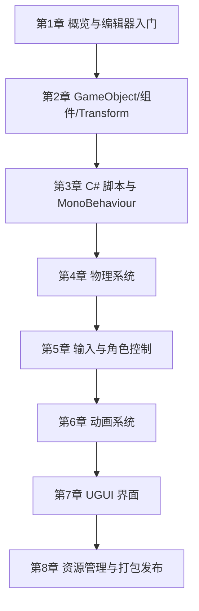

## 1. 这个板块在讲什么

本板块是一份 **从零到能做小游戏** 的 Unity 教程，沿用「总目录 → 分章节教程」的学习路径：

- **教程总目录**（本页）：8 章按依赖顺序排好，给学习路线、给每章一句话定位；
- **每章一份教程**：`NN-xxx.md`，用「先建立直觉 → 它解决什么问题 → 核心概念 → 动手写 → 常见坑 → 小结」的结构讲清一个主题。

> Unity 是当下最主流的跨平台游戏引擎之一。它的核心思想是 **「一切皆 GameObject，能力皆组件（Component）」**：你在编辑器里拖拽拼接对象，用 C# 脚本给它们注入行为。本教程不堆引擎术语，而是带你把一条**完整链路**跑通：装好引擎 → 理解场景与组件 → 写脚本让物体动起来 → 加上物理、输入、动画、UI → 最后打包成能在手机/电脑上运行的游戏。

## 2. 推荐学习顺序（自底向上）

**阶段一 · 认识引擎（第 1–2 章）**
1. 先搞懂 Unity 是什么、能做什么，把编辑器跑起来，建立第一个场景。
2. 再理解「场景 = 对象树」「行为 = 组件」这套世界观，这是后面一切的基础。

**阶段二 · 让东西动起来（第 3–5 章）**
3. 学 C# 脚本：MonoBehaviour 的生命周期、怎么读输入、怎么移动物体。
4. 理解物理：刚体、碰撞体、力，让物体自然掉落与碰撞。
5. 把输入接到角色上，做出「按方向键移动」的第一人称/第三人称控制器。

**阶段三 · 让它像个游戏（第 6–8 章）**
6. 用 Animator 状态机播放走路、跳跃等动画。
7. 用 UGUI 做血条、按钮、主菜单等界面。
8. 学会预制体复用、资源管理（Addressables）与跨平台打包发布。

## 3. 环境准备

本教程基于 **Unity 2022 LTS / 2023 LTS**（长期支持版，稳定优先）。安装方式：

1. 下载 **Unity Hub**（官方统一管理工具）：https://unity.com/download
2. 在 Hub 里安装一个 **LTS** 版本，并勾选模块：
   - **Microsoft Visual Studio 2022**（或 VS Code + C# 插件）— 写脚本用；
   - 目标平台模块：**Android Build Support** / **iOS Build Support**（按需勾选，不勾也能先在 Windows/Mac 跑）；
   - **Documentation** 可选。
3. 安装时务必勾选 **.NET 4.x / .NET Standard 2.1** 兼容层（新版默认已包含）。

| 工具 | 在本教程的角色 |
|------|----------------|
| Unity Hub | 管理引擎版本与项目 |
| Unity Editor | 编辑场景、拖拽组件、运行预览 |
| Visual Studio / VS Code | 编写 C# 脚本（推荐 VS，断点调试最强） |
| 目标平台模块 | 把游戏打包成 APK / IPA / EXE 等 |

> **硬件现实**：Unity 编辑器本身不吃显卡，但**实时光照、烘焙、大场景预览**需要独立显卡。入门阶段集显也能跑通本教程所有示例。建议 16 GB 内存起步，SSD 必选（项目加载快很多）。

## 4. 章节速查

| # | 章节 | 一句话定位 |
|---|------|-----------|
| 01 | 概览与编辑器入门 | Unity 是什么、装好引擎、认识界面、建第一个场景 |
| 02 | GameObject、组件与 Transform | 场景=对象树、行为=组件、Transform 的位置/旋转/缩放 |
| 03 | C# 脚本基础与 MonoBehaviour | 生命周期函数、变量、让物体动起来的脚本 |
| 04 | 物理系统 | Rigidbody、Collider、力、关节与触发检测 |
| 05 | 输入与角色控制 | 新输入系统、CharacterController、移动与视角 |
| 06 | 动画系统 | Animator、状态机、混合树、动画事件 |
| 07 | UGUI 界面 | Canvas、RectTransform、按钮事件、血条/菜单 |
| 08 | 资源管理与打包发布 | 预制体、Addressables、Build Settings、跨平台 |

> 本板块持续整理中。每章会逐步补充可运行示例、踩坑记录与推荐资料；如有错误欢迎通过博客评论或邮件反馈。
